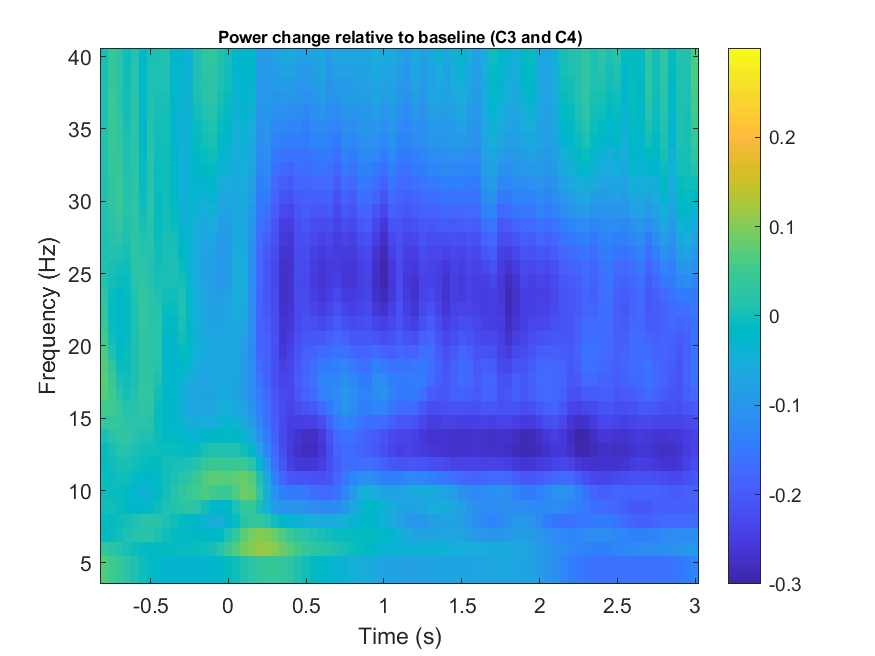
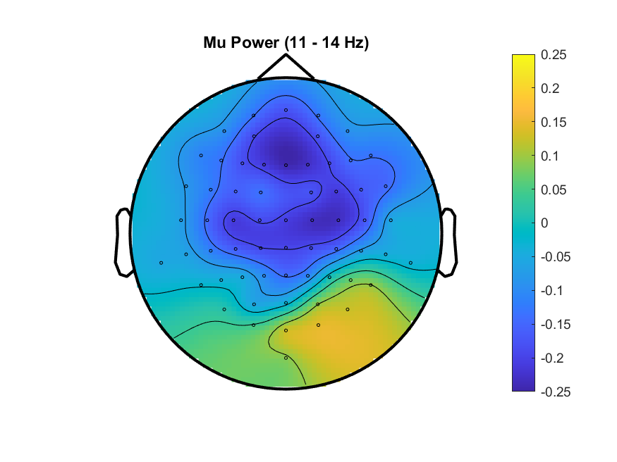
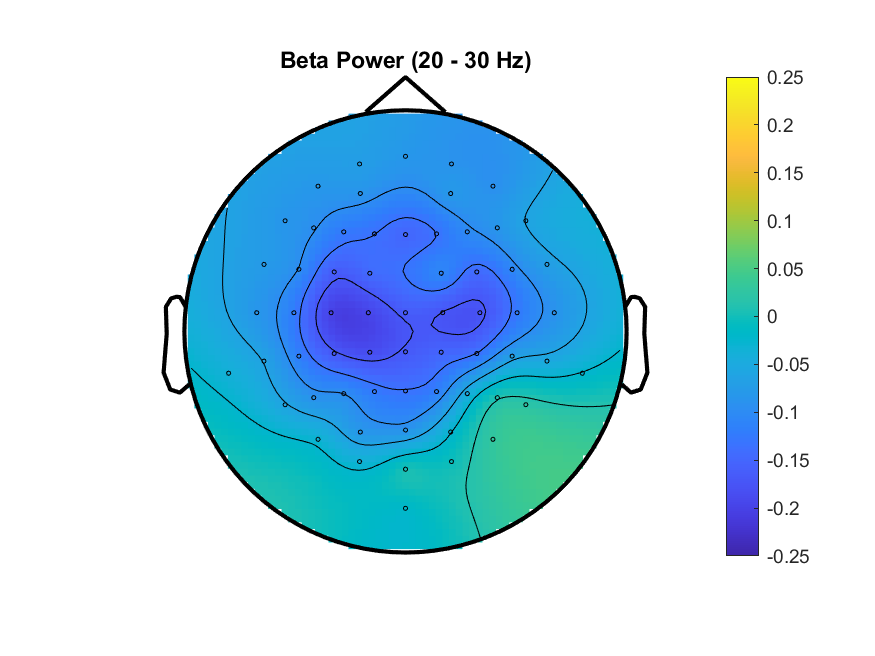
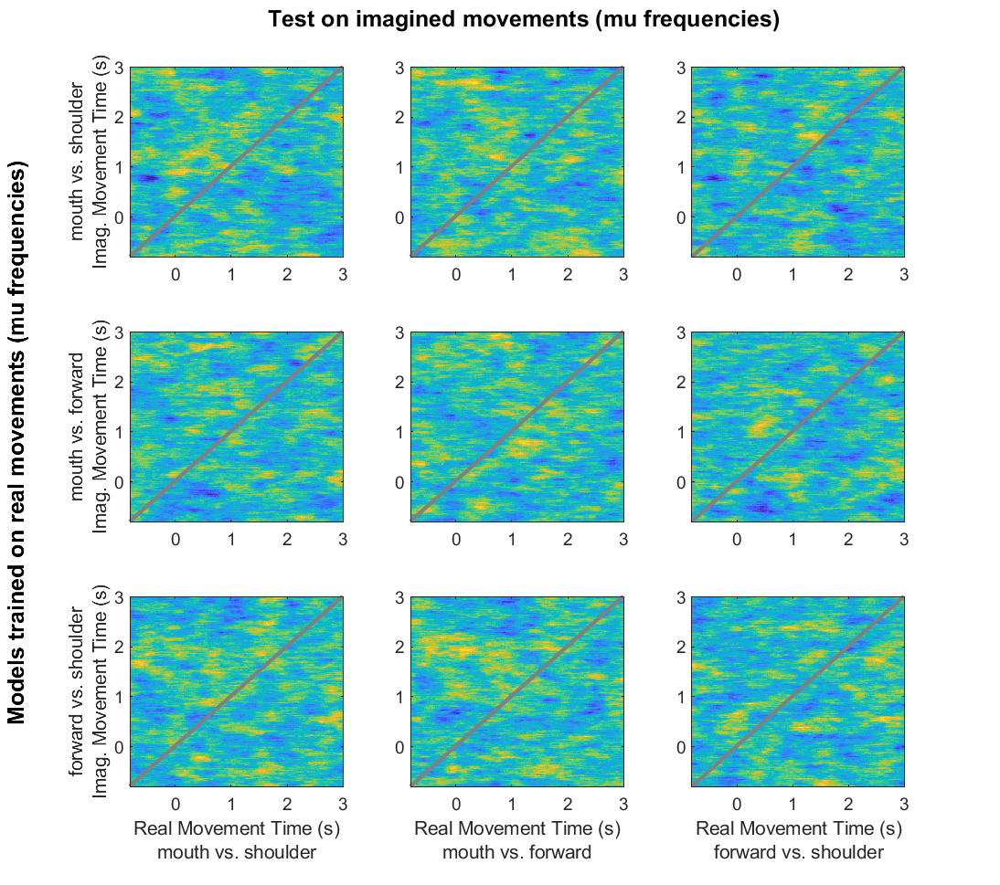
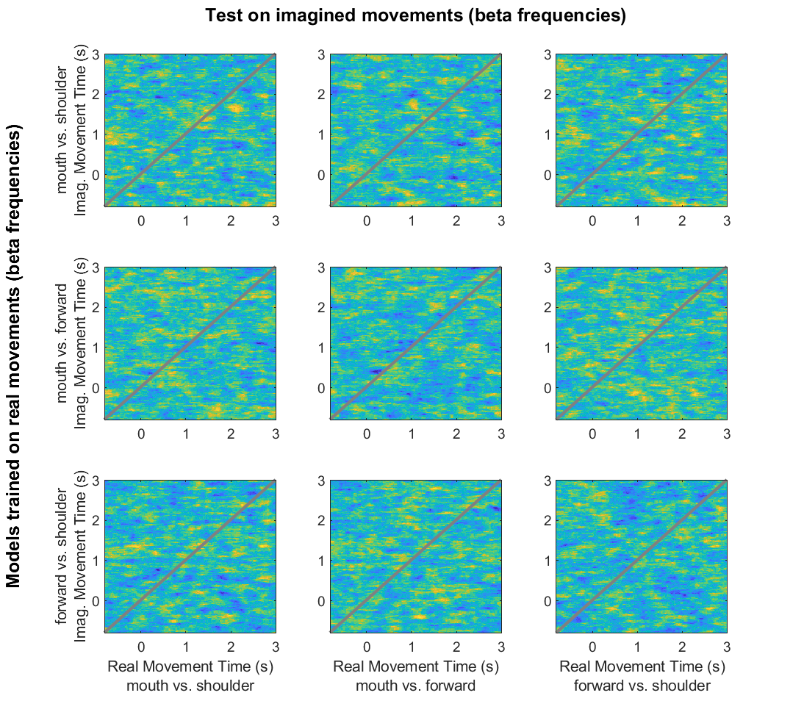
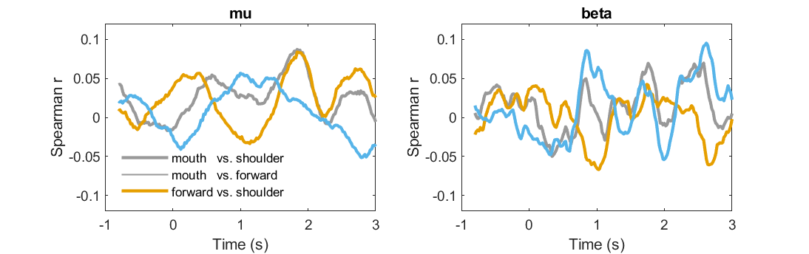

# GraspMI
EEG study on ...
## Stimuli and Procedure
6 runs with 39 trials each
alternating runs with real movement and imagined movement (starting condition balanced across participants)
three movement randomized within each block: mouth, shoulder, forward. Indicated by red, green or blue color of a fixation cross as a cue. Color mapping was balanced across participants. 

## Analysis
### Preprocessing
Per participant, the EEG and motion data were converted to BIDS format. As a part of the data transform, trial information was gathered from protocol files and added to event files. The motion data was used to identify  actual movement onsets in trials were real movements were required. Moreover, trials where movements occurred in the imagery conditions, or no movement occurred in the real movement condition were marked as invalid. These information were added to the EEG event files and were later used for epoching and selection of trials.

The EEG synchronization markers reflect the presentation onset of cues that instructed participants to (a) start the movement in real movement trials and (b) start imagining the movement in imagery trials. In real movement trials, the onsets were re-defined to the actual movement onsets according to the motion data files. 

For artifact correction, first pass, the data was epoched and visually inspected for bad channels and irregular artefacts. Artefacts related to blinks and eye movements were spared out. Information about bad epoch (i. e., bad trials) were added to the EEG event files, and information about bad channels were saved for later use.

To account for indiosyncratic raw data (e. g. different EEG marker values) and to allow for a visual inspection of the data, preprocessing steps were done with individual scripts. E. g., for participant S01: 
- *./preproc/convEEG2bids_S01.m*:  convert raw Brain Vision EEG data to BIDS
- *./preproc/convCSV2bids_S01.m*: convert raw Polhemus motion data to BIDS
- *./preproc/add_motion_onset_S01.m*: add motion onsets to EEG data
- *./preproc/firstpass_EEGartefact_S01.m*: filter 1 - 40Hz, epoch -0.5 - 3s, identify bad epochs and channels and write to events file
- *./preproc/get_ICs.m*: loop over all participants, get ICs using only good epochs and channels, save ICs
- *./preproc/identify_bad_components_S01.m*: identify bad components and write to events file
- *./preproc/secondpass_EEGartefact_S01.m*: remove bad components, interpolate bad channels, identify remaining bad epochs and write to events file

- complete preprocessing without user intervention can be performed from src/run01_preprocessing.m

Protocol 1st pass artifact
S09, many single-electrode artefacts
S10, second pass, FC electrodes almost flat
S11, strong hf noise at frontal electrodes in some trials, mainly first half of experiment
S12, noisy
S13, very noisy, six broken channels, remove from data set (even more broken channels in 2nd pass)
S15, excessive eye movements and blinks, not well removed from EEG data after ICA
S16, noisy
S18, slow drifts, otherwise OK
S23, slow drifts, otherwise fine

### Main analysis
Main analysis focusses on beta band activity and CSP patterns. Previous studies used
15-25 Hz, sensor level: Turella 2016
0.3 - 4 Hz, sensors, Hooks 2023 (reach-to-grasp)
mu (8-12) and beta (13-30), Abbasi 2026
mu 8-14, beta around 20, Blankertz 2008

Previous studies revealed beta band modulations during hand movement planning and execution (Turella), see also Zaepffel 2013. Beta and mu decrease during planning and movement (but increase after cue).

To identify suitable frequency ranges for the main analysis, a time-frequency-decompition was performed on all trials in real movement conditions. The data showed clear power decreases in the movement execution phase in two distinct frequency bands, mu (11-14 Hz) and beta (20-30 Hz). Both were prominent at central and fronto-central electrodes. Topografies show the mean mu and beta power between 0 and 3 s after cue onset.

Run this part of the analysis with 
- *./run02_FOI_plot.m* .

## Results

All decoding was performed on CSPs that were derived from EEG data that was pre-filetered in the mu and beta frequency ranges. For classification, a linear discriminant analysis was used (LDA, 5-fold cross-validation, 100 repetitions) .

### Decoding real movements

Real movement conditions were subjected to pairwise decoding (i. e.: mouth vs. shoulder, mouth vs. forward, forward vs. shoulder). A sliding window of 0.3 s was used on each 0.01 s bin from -0.8 to 3 s. Result
In both mu and beta frequencies, only for the mouth v. forward condition the decoding accuracy was above chance (mu: 0.33 - 3s, p < .00? as revealed by permutation test, maximum accuracy at 1.66s; beta: ?? - ??s, p < .0?, maximum accuracy 2.23 ).

Run this part of the analysis with 
- *./run03_decoding.m* and
- *./run04_decoding_plot.m*.

### Cross-decoding

Classifiers that were trained on real movements were used for used for classifying imagined movements (3 by 3). A sliding window of 0.3s was used on every 0.02s bin between -0.8 and 3s. For multiple comparison correction, the number of adjacent significant bins were used for a permutation distribution. Color sclae is from .45 to .55.
None of the results survided the correction for multiple comparisons.

Run this part of the analysis with 
- *./run05_cross_decoding.m* and
- *./run06_cross_decoding_plot.m*.

### Correlation with imagery rating

In a next set of analyses, it was tested whether (and when) the decoding accuracy for imagined movements correlated with the imagery rating that was obtained after each trial. Classifiers were trained on real-movment data, within the time ranges where they showed the highest classification accuracy (mu: 1.66s, beta: 2.23s). For beta frequencies, there was a later peak in accuracy, but this was considered too close to the edge of the time window of interest.

Sliding windows were adjusted in size so that they contained 7 cycles of the target frequency, 0.56s for mu and 0.28s for beta. There were no significant findings.

Run this part of the analysis with 
- *./run07_cross_decoding_corr.m* and
- *./run08_cross_decoding_corr_plot.m*.

